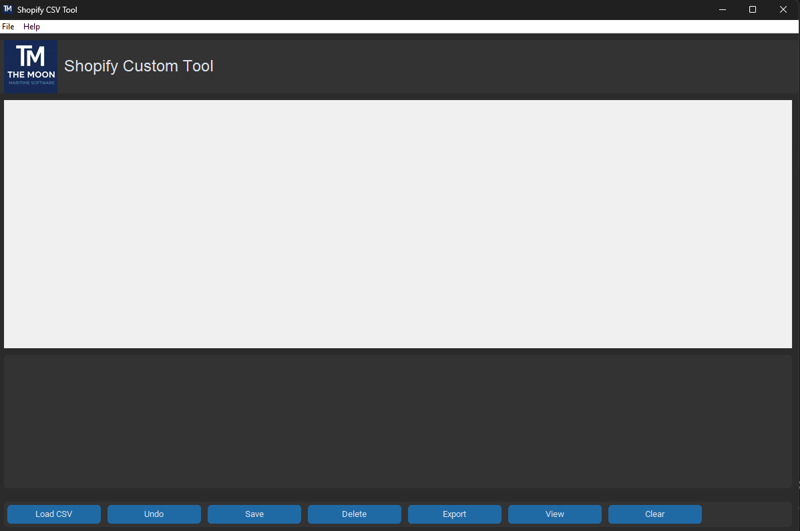
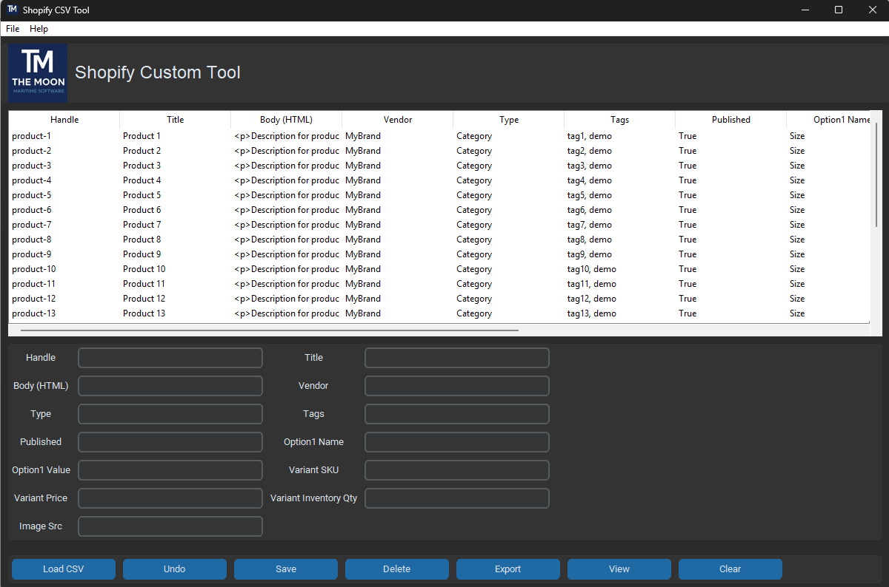
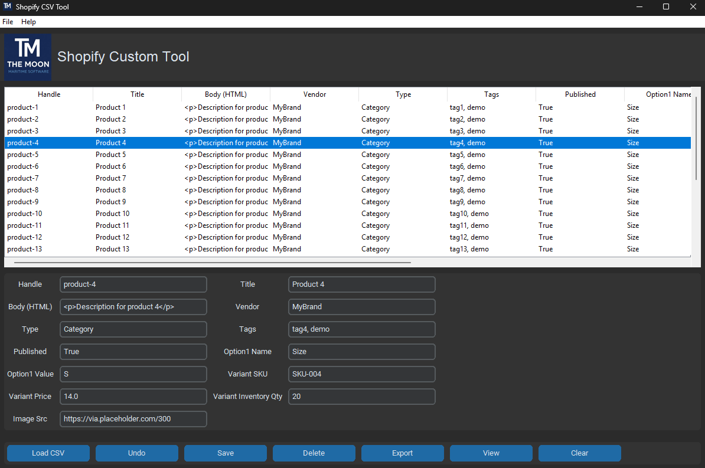
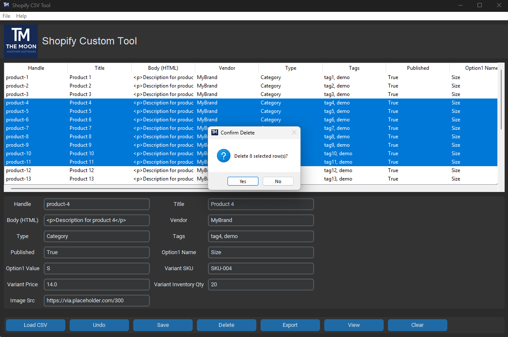
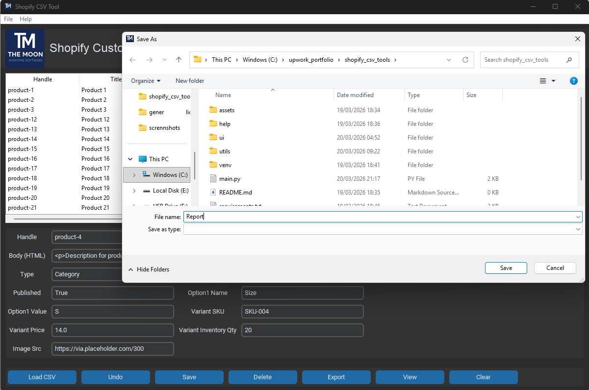

 # Shopify CSV Editor & Cleaner Tool

---

## 🚀 Download

👉 **[⬇ Download Latest Release](../../releases)**  

- ✔ Ready-to-use `.exe`
- ✔ Installer (`setup.exe`)
- ✔ No Python required

---

## 📌 Overview

Shopify CSV Editor & Cleaner Tool is a lightweight desktop application designed to simplify working with Shopify product CSV files.

It allows you to quickly edit, clean, validate, and export product data without Excel complexity.

---

## ✨ Features

- Load Shopify CSV files  
- Edit products via form interface  
- Full table view (Excel-like)  
- Add / update / delete rows  
- Clean and organize product data  
- Export updated CSV  
- Fast and lightweight desktop app  
- 14-day demo license system  

---

## 🖥️ Screenshots

### Main Interface

### Editing Panel

### Full Table View

### Data Management

### Export & Workflow

---

## ⚙️ Installation

1. Download `setup.exe` from Releases  
2. Run installer  
3. Launch application from desktop  

No additional dependencies required  

---

## 🧪 Demo License

- 14 days free trial  
- After expiration, license activation is required  

---

## 💰 Pricing

Full version: $15  

---

## 📄 User Manual

Detailed guide included in the repository:

help/user_manual.pdf

---

## 🛠️ Tech Stack

- Python  
- CustomTkinter  
- Pandas  
- PyInstaller  
- Inno Setup  

---

## 👨‍💻 Author

The Moon Studio  

---

## 📬 Contact

For support or licensing:

- Upwork  
- Email (optional)   